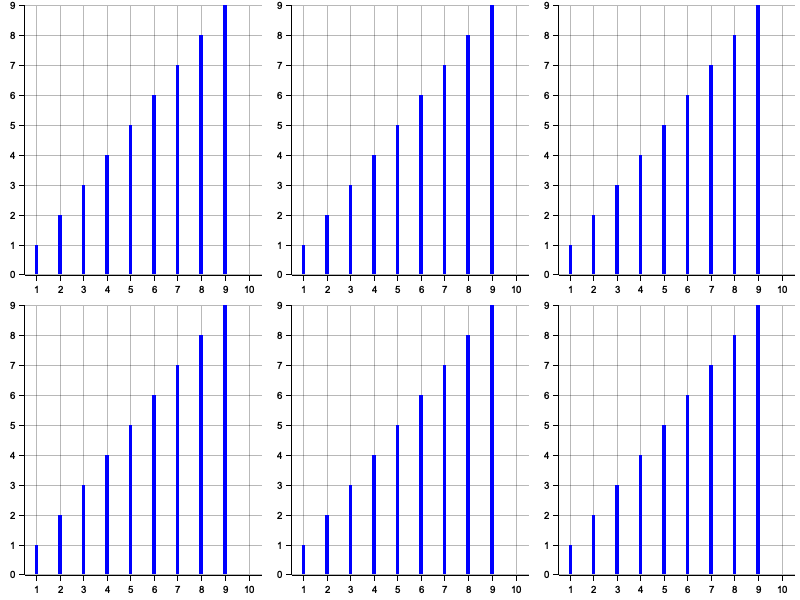

# Spaceship Titanic

# Data

PassengerId :PassengerId
HomePlanet- 승객이 출발한 행성, 일반적으로 영주권이 있는 행성입니다.

CryoSleep- 승객이 항해 기간 동안 애니메이션을 정지하도록 선택했는지 여부를 나타냅니다. 냉동 수면 중인 승객은 객실에 갇혀 있습니다.
Cabin- 승객이 머무르는 객실 번호. Port 또는 Starboarddeck/num/side 의 형식 을 취side 합니다 .PS

Destination- 승객이 내릴 행성.
Age- 승객의 나이.
VIP- 승객이 항해 중 특별 VIP 서비스 비용을 지불했는지 여부.
RoomService, FoodCourt, ShoppingMall, Spa, - 우주선 타이타닉VRDeck 의 다양한 고급 편의 시설 각각에 대해 승객이 청구한 금액입니다 .
Name- 승객의 이름과 성.
Transported : target


## 데이터 확인
```
┌─────────────┬────────────┬───────────┬───────┬───┬─────┬────────┬──────┬────────────┐
│ PassengerId ┆ HomePlanet ┆ CryoSleep ┆ Cabin ┆ … ┆ Spa ┆ VRDeck ┆ Name ┆ Transporte │
│ ---         ┆ ---        ┆ ---       ┆ ---   ┆   ┆ --- ┆ ---    ┆ ---  ┆ d          │
│ u32         ┆ u32        ┆ u32       ┆ u32   ┆   ┆ u32 ┆ u32    ┆ u32  ┆ ---        │
│             ┆            ┆           ┆       ┆   ┆     ┆        ┆      ┆ u32        │
╞═════════════╪════════════╪═══════════╪═══════╪═══╪═════╪════════╪══════╪════════════╡
│ 0           ┆ 201        ┆ 217       ┆ 199   ┆ … ┆ 183 ┆ 188    ┆ 200  ┆ 0          │
└─────────────┴────────────┴───────────┴───────┴───┴─────┴────────┴──────┴────────────┘
```
## 결측치 채우기

- CryoSleep:
- VIP
- Cabin
- HomePlanet
- Destination

## Histogram확인 




- Age를 제외한 나머지는 0으로 취우쳐져 있음
- 나이가 20 ~ 30 인 사람들이 서비스를 많이 이용
- 소수의 인원만 금액을 많이 사용한것을 확인 가능

## Cabin
- 종류 , 호수, 방 위치로 분할

## VIP
- VIP를 신청한 인원중 제대로 도착한 인원 38%
- 신청하지 않은 사람중 도착학 인원 약 50%
```
┌─────┬──────────────────┐
│ VIP ┆ Transported_mean │
│ --- ┆ ---              │
│ i64 ┆ f64              │
╞═════╪══════════════════╡
│ 1   ┆ 0.38191          │
│ 0   ┆ 0.506475         │
└─────┴──────────────────┘
```
- 하지만 신청하지 않은 사람이 압도적으로 많으므로 크게 영향 x
```
shape: (2, 2)
┌─────┬───────┐
│ VIP ┆ count │
│ --- ┆ ---   │
│ i64 ┆ u32   │
╞═════╪═══════╡
│ 0   ┆ 4302  │
│ 1   ┆ 76    │
└─────┴───────┘
shape: (2, 2)
┌─────┬───────┐
│ VIP ┆ count │
│ --- ┆ ---   │
│ i64 ┆ u32   │
╞═════╪═══════╡
│ 0   ┆ 4192  │
│ 1   ┆ 123   │
└─────┴───────┘
```
## CryoSleep

```
CryoSleep::shape: (2, 2)
┌───────────┬──────────────────┐
│ CryoSleep ┆ Transported_mean │
│ ---       ┆ ---              │
│ i64       ┆ f64              │
╞═══════════╪══════════════════╡
│ 0         ┆ 0.335042         │
│ 1         ┆ 0.817583         │
└───────────┴──────────────────┘
```
- 신청한사람의 80가 도착